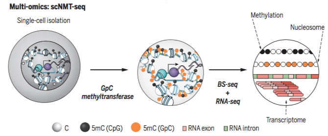

scNMT-seq
=========

Source code of the manuscript ***Joint profiling of chromatin accessibility, DNA methylation and transcription in single cells***.

Abstract
--------
Parallel single-cell sequencing protocols represent powerful methods for investigating regulatory relationships, including epigenome-transcriptome interactions. Here, we report the first single-cell method for parallel chromatin accessibility, DNA methylation and transcriptome profiling. scNMT-seq (single-cell nucleosome, methylation and transcription sequencing) uses a GpC methyltransferase to label open chromatin followed by bisulfite and RNA sequencing. We validate scNMT-seq by applying it to mouse embryonic stem cells and embryoid body cells, finding links between all three molecular layers and revealing dynamic coupling between epigenomic layers during differentiation.

 
​

For more details you can read our preprint: https://www.biorxiv.org/content/early/2017/11/10/217554

Content
-------
* `/serum_cells/`: analysis done on ~100 embryonic stem cells under serum conditions
* `/EB_cells/`: analysis done on ~50 embryonic body cells

Data
-------
The raw data is accessible at GEO [GSE109262](https://www.ncbi.nlm.nih.gov/geo/query/acc.cgi?acc=GSE109262). Parsed data is provided upon request.

Contact
-------
* Computational analysis: Ricard Argelaguet (ricard@ebi.ac.uk) or Andreas Kapourani (c.a.kapourani@ed.ac.uk)
* Experimental protocol: Stephen Clark (stephen.clark@babraham.ac.uk)
